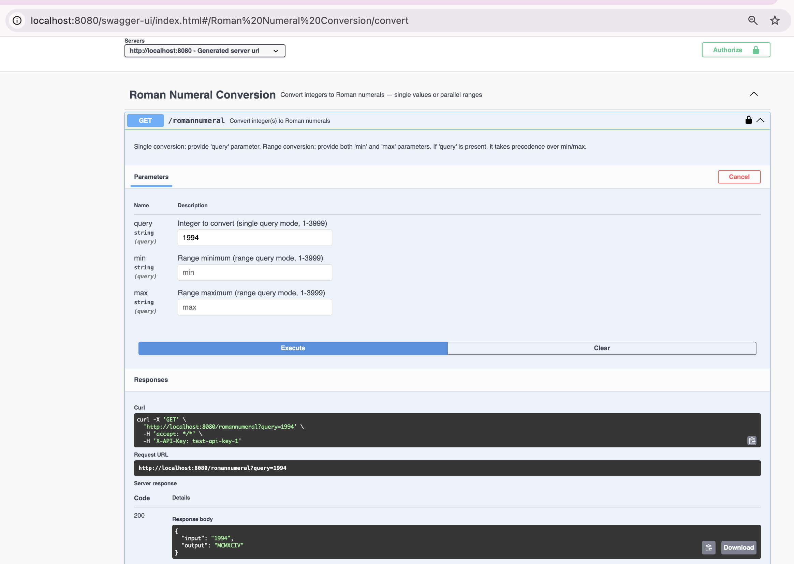
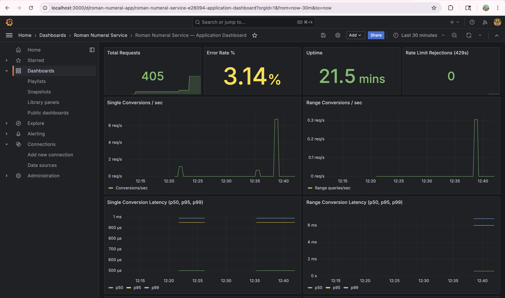
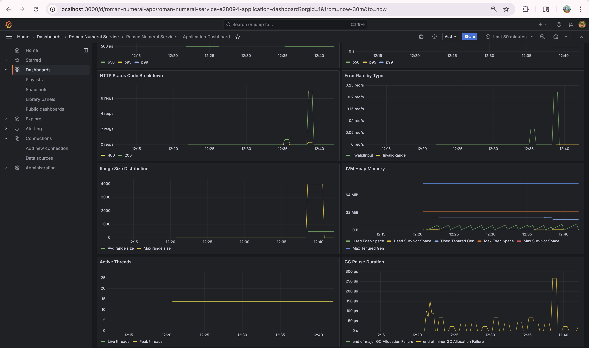
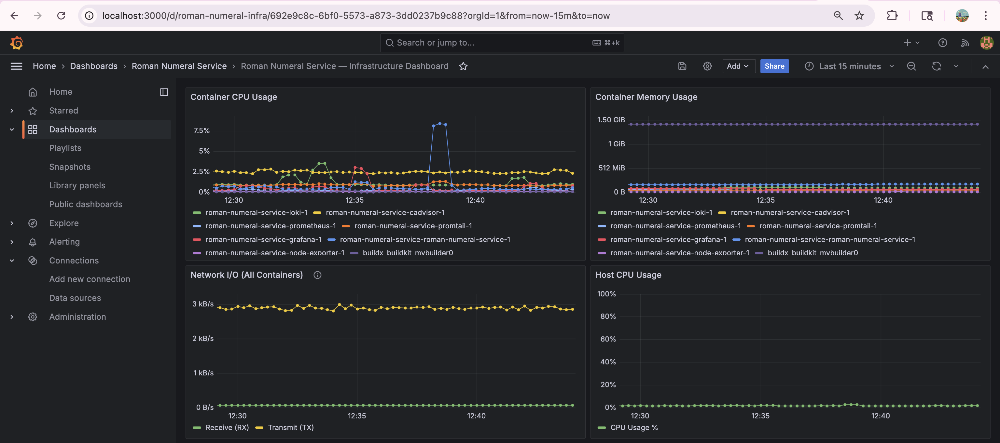
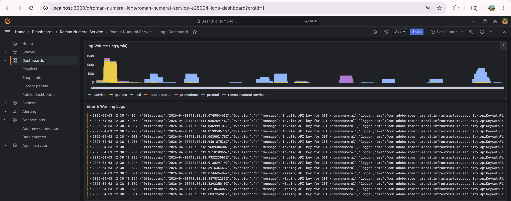
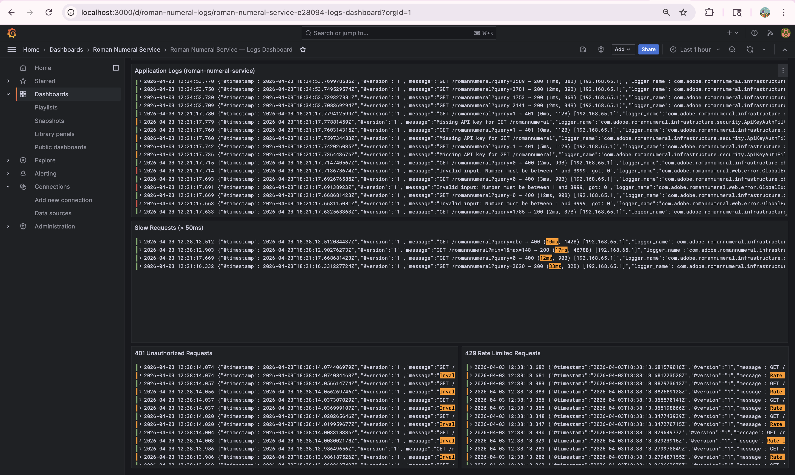
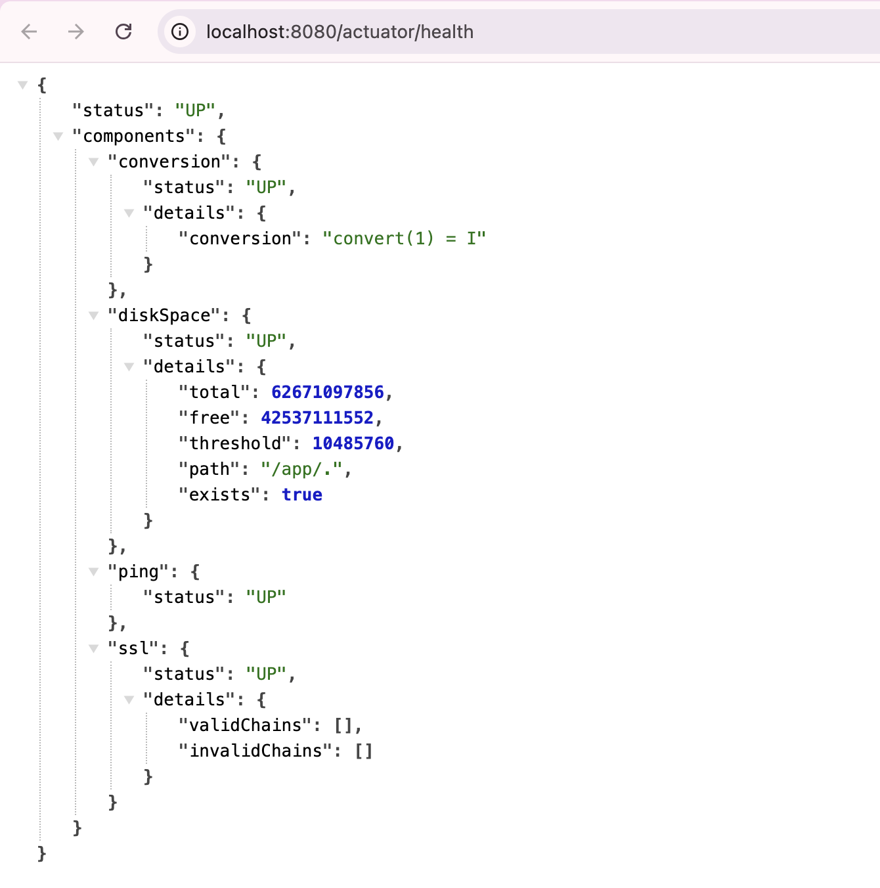

# Roman Numeral Conversion Service

[](https://github.com/dhinupriya/roman-numeral-service/actions/workflows/ci.yml)

Production-grade HTTP service that converts integers (1-3999) to Roman numerals. Built with Java 21, Spring Boot 3.4, and Clean Architecture. Supports single conversions and parallel range queries using chunked virtual thread execution.

**Roman Numeral Specification**: [Wikipedia: Roman Numerals — Standard Form](https://en.wikipedia.org/wiki/Roman_numerals#Standard_form)

---

## Table of Contents

- [How to Build and Run](#how-to-build-and-run)
- [API Documentation](#api-documentation)
- [Architecture](#architecture)
- [Engineering Methodology](#engineering-methodology)
- [Testing Methodology](#testing-methodology)
- [Packaging Layout](#packaging-layout)
- [Observability](#observability)
- [Security](#security)
- [Load Testing](#load-testing)
- [Docker](#docker)
- [CI/CD](#cicd)
- [Architecture Decision Records](#architecture-decision-records)
- [Dependency Attribution](#dependency-attribution)
- [Production Roadmap](#production-roadmap)

---

## How to Build and Run

### Prerequisites

- Java 21+ ([Amazon Corretto](https://docs.aws.amazon.com/corretto/latest/corretto-21-ug/downloads-list.html) or [Eclipse Temurin](https://adoptium.net/))
- Maven 3.9+ (or use included Maven wrapper `./mvnw`)
- Docker & Docker Compose (for containerized deployment)

### Run Locally

```bash
# Build and run all tests (including JaCoCo 80% coverage gate)
./mvnw clean verify

# Start the application
./mvnw spring-boot:run

# Test single conversion
curl -H "X-API-Key: test-api-key-1" "localhost:8080/romannumeral?query=1994"
# → {"input":"1994","output":"MCMXCIV"}

# Test range conversion (parallel)
curl -H "X-API-Key: test-api-key-1" "localhost:8080/romannumeral?min=1&max=10"
# → {"conversions":[{"input":"1","output":"I"},{"input":"2","output":"II"},...]}
```

### Run with Docker Compose

```bash
docker compose up -d

# Wait ~45 seconds for all services to be healthy
# (Loki and Prometheus have healthchecks — the app waits for them before starting)
docker compose ps   # all should show "healthy" or "Up"

# Test (same API key)
curl -H "X-API-Key: test-api-key-1" "localhost:8080/romannumeral?query=42"

# Open Grafana dashboards
open http://localhost:3000  # admin/admin

# Stop
docker compose down
```

> **Note:** First startup takes ~45-60 seconds. Loki initializes its storage and Prometheus starts scraping before the application and Grafana launch. Subsequent startups are faster. All services have healthchecks — `docker compose ps` shows status.

---

## API Documentation

### Interactive Swagger UI

Available at [localhost:8080/swagger-ui/index.html](http://localhost:8080/swagger-ui/index.html) (no API key required).



OpenAPI 3.1 JSON spec at [localhost:8080/v3/api-docs](http://localhost:8080/v3/api-docs).

### Endpoints

#### Single Conversion

```
GET /romannumeral?query={integer}
Header: X-API-Key: <your-key>
```

**Success (200):**
```json
{"input": "1994", "output": "MCMXCIV"}
```

#### Range Conversion (Parallel)

```
GET /romannumeral?min={integer}&max={integer}
Header: X-API-Key: <your-key>
```

**Success (200):**
```json
{
  "conversions": [
    {"input": "1", "output": "I"},
    {"input": "2", "output": "II"},
    {"input": "3", "output": "III"}
  ]
}
```

#### Error Response (400/401/429/500)

```json
{"error": "Bad Request", "message": "Number must be between 1 and 3999, got: 0", "status": 400}
```

#### Actuator (No API Key Required)

| Endpoint | Purpose |
|----------|---------|
| `/actuator/health` | Health check with custom conversion indicator |
| `/actuator/prometheus` | Prometheus-format metrics |
| `/actuator/info` | Application info |

---

## Architecture

### Clean / Hexagonal Architecture

Dependencies point inward. Domain has zero framework imports.

```
┌─────────────────────────────────────────────────────┐
│                 Infrastructure                       │
│  ┌──────────┐ ┌──────────┐ ┌──────────┐           │
│  │ Security │ │Observable│ │ Config   │           │
│  │ Filters  │ │ Metrics  │ │ Wiring   │           │
│  └──────────┘ └──────────┘ └──────────┘           │
│                                                      │
│  ┌──────────────────────────────────────────────┐   │
│  │              Web Layer                        │   │
│  │  Controller → DTOs → Error Handler            │   │
│  └──────────────────────┬───────────────────────┘   │
│                         │                            │
│  ┌──────────────────────▼───────────────────────┐   │
│  │           Application Layer                   │   │
│  │  ConvertSingleUseCase  ConvertRangeUseCase    │   │
│  │         ↓ port                ↓ port          │   │
│  └──────────────────────┬───────────────────────┘   │
│                         │                            │
│  ┌──────────────────────▼───────────────────────┐   │
│  │              Domain Layer                     │   │
│  │  RomanNumeralConverter (interface/port)        │   │
│  │  RomanNumeralResult, RomanNumeralRange (VOs)   │   │
│  │  DomainException hierarchy (sealed)            │   │
│  │  *** Zero Spring imports ***                   │   │
│  └──────────────────────────────────────────────┘   │
└─────────────────────────────────────────────────────┘
```

### Dual Converter Strategy

- **Single queries** (`?query=42`): `CachedRomanNumeralConverter` — pre-computed array, O(1) lookup
- **Range queries** (`?min=1&max=3999`): `StandardRomanNumeralConverter` + `ChunkedParallelExecutor` — real parallel computation using virtual threads, 1 chunk per CPU core

### Algorithm

Descending value-table approach with 13-entry parallel arrays (7 standard symbols + 6 subtractive forms). Greedy subtraction, O(1) bounded (max 15 iterations). Hand-written — no libraries.

---

## Engineering Methodology

### Principles Applied

- **SOLID** — Single Responsibility (separate use cases), Open/Closed (converter interface), Liskov Substitution (cached/standard converters), Interface Segregation (ports), Dependency Inversion (domain defines interfaces)
- **Clean Architecture** — domain layer has zero framework dependencies, testable with `new StandardRomanNumeralConverter()`
- **DRY** — shared `FilterResponseHelper` for filter error responses
- **YAGNI** — no pagination (not required), sequential cache build (4ms not worth parallelizing)

### Design Patterns Used (7)

| Pattern | Where | Why |
|---------|-------|-----|
| **Strategy** | `RomanNumeralConverter` interface | Open/Closed — swap implementations |
| **Decorator** | `CachedConverter` wraps `StandardConverter` | Adds caching without modifying algorithm |
| **Value Object** | `RomanNumeralResult`, `RomanNumeralRange` (records) | Immutable, self-validating, thread-safe |
| **Port/Adapter** | Domain ports + infrastructure adapters | Framework-free domain |
| **Use Case** | `ConvertSingleNumberUseCase`, `ConvertRangeUseCase` | Single responsibility per workflow |
| **Factory Method** | `Response.from()` on DTOs | Mapping logic co-located with DTO |
| **DI (Constructor)** | `@RequiredArgsConstructor` + explicit `ConverterConfig` | Testable, explicit wiring |

---

## Testing Methodology

### Testing Pyramid

```
                ┌──────────┐
                │  Load    │  ← k6 (load, stress, spike, soak)
              ┌─┴──────────┴─┐
              │  Security     │  ← API key, rate limit, headers
            ┌─┴──────────────┴─┐
            │   Integration     │  ← @SpringBootTest, full E2E
          ┌─┴──────────────────┴─┐
          │    API Slice (Web)    │  ← @WebMvcTest, JSON structure
        ┌─┴──────────────────────┴─┐
        │       Unit Tests          │  ← Domain logic, use cases
        └───────────────────────────┘
```

### Test Summary — 192 Tests

| Test Class | Count | What It Tests |
|-----------|-------|---------------|
| `StandardRomanNumeralConverterTest` | 62 | Algorithm: all symbols, subtractive forms, boundaries, exhaustive 1-3999, thread safety |
| `CachedRomanNumeralConverterTest` | 8 | Cache matches standard for all 3999 values, O(1) lookup, thread safety |
| `RomanNumeralRangeTest` | 17 | Self-validating VO: min≥max, out-of-range, record contract |
| `RomanNumeralResultTest` | 7 | Null safety, equality, hashCode |
| `ConvertSingleNumberUseCaseTest` | 2 | Delegation, exception propagation |
| `ConvertRangeUseCaseTest` | 2 | Delegation, converter function passing |
| `ChunkedParallelExecutorTest` | 12 | Ordering, chunking, remainder, error handling, concurrency |
| `RomanNumeralControllerTest` | 43 | Routing, validation, JSON structure, error format, XSS |
| `RomanNumeralIntegrationTest` | 18 | Full E2E: single, range, 1-3999, errors, concurrency |
| `ActuatorIntegrationTest` | 7 | Health, Prometheus metrics, actuator endpoints |
| `ApiSecurityTest` | 11 | API key auth: missing, invalid, valid, actuator bypass, headers |
| `RateLimitTest` | 3 | Token-bucket: single 429, range 429, JSON format |

### Run Tests

```bash
./mvnw clean test          # run all 192 tests
./mvnw verify              # run tests + JaCoCo coverage check (≥80%)
```

**Coverage: 94.5% line, 95.9% instruction** (JaCoCo threshold: 80%)

---

## Packaging Layout

```
src/main/java/com/adobe/romannumeral/
├── domain/                    ← Core business logic (zero Spring imports)
│   ├── model/                 ← Value Objects (RomanNumeralResult, RomanNumeralRange)
│   ├── service/               ← Ports/interfaces (RomanNumeralConverter, Constants)
│   └── exception/             ← Sealed exception hierarchy
├── application/               ← Use cases + ports
│   ├── usecase/               ← ConvertSingleNumberUseCase, ConvertRangeUseCase
│   └── port/                  ← ParallelExecutionPort interface
├── infrastructure/            ← Framework adapters
│   ├── converter/             ← StandardConverter (algorithm), CachedConverter (O(1))
│   ├── execution/             ← ChunkedParallelExecutor (virtual threads)
│   ├── config/                ← ConverterConfig, SecurityConfig, AppProperties, OpenAPI
│   ├── observability/         ← ConversionMetrics, CorrelationIdFilter, RequestLoggingFilter
│   ├── security/              ← ApiKeyAuthFilter, RateLimitFilter, FilterResponseHelper
│   └── health/                ← ConversionHealthIndicator
└── web/                       ← HTTP layer
    ├── controller/            ← RomanNumeralController
    ├── dto/                   ← SingleConversionResponse, RangeConversionResponse, ErrorResponse
    └── error/                 ← GlobalExceptionHandler
```

**Why this structure:** Dependencies point inward. The domain layer defines interfaces (what the system does), infrastructure provides implementations (how it does it). You can test the converter with `new StandardRomanNumeralConverter()` — no Spring context needed.

---

## Observability

### Unified Grafana (One UI for Everything)

```
Grafana (localhost:3000)
├── App Dashboard       ← conversion rates, latency (p50/p95/p99), errors, JVM
├── Infra Dashboard     ← CPU, memory, network per container
└── Logs Dashboard      ← structured logs searchable by service, level, status
```

#### Application Dashboard



#### Infrastructure Dashboard


#### Logs Dashboard



### Metrics

| Metric | Type | Description |
|--------|------|-------------|
| `roman_conversion_single_total` | Counter | Total single conversions |
| `roman_conversion_single_duration_seconds` | Timer | Single conversion latency |
| `roman_conversion_range_total` | Counter | Total range conversions |
| `roman_conversion_range_duration_seconds` | Timer | Range conversion latency |
| `roman_conversion_range_size` | Distribution | Range sizes requested |
| `roman_conversion_error_total{type=...}` | Counter | Errors by type |

Plus Spring Actuator auto-configured: `http_server_requests_seconds`, JVM metrics, GC metrics.

### Logging

- **Dev**: human-readable console with correlation ID
- **Docker**: structured JSON via logstash-logback-encoder → Promtail → Loki → Grafana
- **Correlation ID**: UUID per request in MDC + `X-Correlation-Id` response header

### Health

`/actuator/health` includes a custom indicator: `convert(1) == "I"`. Proves the business logic works, not just "JVM alive."



---

## Security

### Request Flow

```
Request → CorrelationId → Logging → API Key Auth → Rate Limit → Security Headers → Controller
```

### API Key Authentication

- Header: `X-API-Key: <key>`
- Configured in `application.yml` (production: use secrets manager)
- Actuator + Swagger UI bypass auth
- 401 if missing or invalid

### Rate Limiting (Bucket4j Token-Bucket)

| Endpoint | Limit | Bucket |
|----------|-------|--------|
| Single query (`?query=...`) | 100 req/s | Greedy refill |
| Range query (`?min=...&max=...`) | 10 req/s | Greedy refill |

429 Too Many Requests with `Retry-After: 1` header.

### Security Headers

- `X-Content-Type-Options: nosniff`
- `X-Frame-Options: DENY`
- `Cache-Control: no-cache, no-store`
- `Strict-Transport-Security` (HTTPS only)
- CORS: deny all cross-origin by default

### Production Recommendations (Tier 3)

| Layer | Where | Recommendation |
|-------|-------|---------------|
| OAuth2/JWT | API Gateway (Kong, AWS) | Multi-tenant environments |
| mTLS | Service mesh (Istio) | Network-level encryption |
| WAF | Cloud provider (AWS WAF) | DDoS, bot filtering |

---

## Load Testing

### k6 Test Suite

| Test | Question | Parameters |
|------|----------|-----------|
| `load-test.js` | Can we handle expected traffic? | 100 VUs, 5 min, p95 < 50ms |
| `stress-test.js` | Where does it break? | Ramp to 500 VUs, 10 min |
| `spike-test.js` | Can we handle sudden bursts? | 10 → 500 → 10 VUs |
| `soak-test.js` | Are there memory leaks? | 50 VUs, 30 min |

### Run

```bash
# Locally (requires k6 installed)
k6 run k6/load-test.js

# Via Docker (app must be running via docker compose up)
docker compose -f k6/docker-compose.k6.yml run k6-load
docker compose -f k6/docker-compose.k6.yml run k6-stress
docker compose -f k6/docker-compose.k6.yml run k6-spike
docker compose -f k6/docker-compose.k6.yml run k6-soak
```

> **Tip:** While k6 runs, open the Grafana App Dashboard at [localhost:3000](http://localhost:3000) — request rates, latency percentiles, error rates, and rate limit rejections all update in real-time.

---

## Docker

### Services

| Service | Port | Purpose |
|---------|------|---------|
| roman-numeral-service | 8080 | Application |
| Prometheus | 9090 | Metrics scraping (15s interval) |
| Grafana | 3000 | Dashboards + log exploration (admin/admin) |
| Loki | 3100 | Log aggregation |
| Promtail | — | Log collection from containers |
| cAdvisor | 8081 | Container metrics (CPU, memory, network) |
| Node Exporter | 9100 | Host metrics |

### Commands

```bash
docker compose up -d           # start everything
docker compose logs -f roman-numeral-service  # follow app logs
docker compose down            # graceful shutdown
```

---

## CI/CD

### GitHub Actions (Primary)

Pipeline: **Checkout → Build → Test → Coverage Check → Docker Build → Docker Push**

- Triggers on push to `main` and pull requests
- Quality gate: JaCoCo ≥ 80% line coverage
- Test + coverage reports archived as artifacts
- Docker push optional (requires `DOCKER_USERNAME`/`DOCKER_PASSWORD` secrets)

### Jenkins (Bonus)

`Jenkinsfile` included for enterprise CI/CD demonstration. Same stages as GitHub Actions.

---

## Architecture Decision Records

All significant technical decisions are documented in [`docs/adr/`](docs/adr/):

| ADR | Decision |
|-----|----------|
| [0001](docs/adr/0001-clean-hexagonal-architecture.md) | Clean/Hexagonal Architecture over Layered |
| [0002](docs/adr/0002-java21-spring-boot-3.4.md) | Java 21 + Spring Boot 3.4.1 |
| [0003](docs/adr/0003-dual-converter-strategy.md) | Dual Converter Strategy (Cached + Standard) |
| [0004](docs/adr/0004-chunked-parallelism.md) | Chunked Parallelism (CPU-core-based) |
| [0005](docs/adr/0005-loki-grafana-over-elk-splunk.md) | Loki + Grafana over ELK/Splunk |
| [0006](docs/adr/0006-unified-grafana-observability.md) | Unified Grafana for metrics, logs, infra |
| [0007](docs/adr/0007-api-key-auth-bucket4j-rate-limiting.md) | API Key + Bucket4j Rate Limiting |

---

## Dependency Attribution

| Dependency | Purpose | License |
|-----------|---------|---------|
| `spring-boot-starter-web` | Embedded Tomcat, Spring MVC, JSON serialization | Apache 2.0 |
| `spring-boot-starter-actuator` | Health, info, metrics, prometheus endpoints | Apache 2.0 |
| `spring-boot-starter-security` | Security headers, CORS, filter chain | Apache 2.0 |
| `spring-boot-starter-validation` | Jakarta Bean Validation (Hibernate Validator) | Apache 2.0 |
| `micrometer-registry-prometheus` | Prometheus metrics format (Grafana) | Apache 2.0 |
| `logstash-logback-encoder` | JSON-structured logging (Loki) | Apache 2.0 |
| `springdoc-openapi-starter-webmvc-ui` | OpenAPI 3.1 spec + Swagger UI | Apache 2.0 |
| `bucket4j-core` | Token-bucket rate limiting | Apache 2.0 |
| `lombok` | `@Slf4j`, `@RequiredArgsConstructor` | MIT |
| `spring-boot-starter-test` | JUnit 5, Mockito, MockMvc, AssertJ | Apache 2.0 |
| `spring-security-test` | Security test utilities | Apache 2.0 |
| `jacoco-maven-plugin` | Code coverage reports, 80% threshold | EPL 2.0 |

---

## Production Roadmap

Features documented but not implemented (appropriate for production, overkill for assessment):

### API Enhancements
- **Pagination**: Not implemented because the client already controls range size via `min`/`max` parameters — effectively client-driven pagination. Max range (3999 values) compresses to ~20KB with gzip. For larger datasets, would add `StreamingResponseBody` for memory-efficient streaming instead of explicit pagination.
- **ETag / Conditional Requests**: Roman numerals are immutable — `ETag` header would enable client-side caching with `304 Not Modified`, saving bandwidth on repeated requests.
- **Content-Type Negotiation**: Support `Accept: text/csv` for bulk downloads alongside JSON.

### Infrastructure
- **Kubernetes + Helm**: Deployment manifests, auto-scaling, liveness/readiness probes (Docker image is K8s-ready with HEALTHCHECK + graceful shutdown)
- **OAuth2/JWT**: At API Gateway layer (Kong, AWS API Gateway) for multi-tenant auth
- **mTLS**: Service mesh (Istio, Linkerd) for network-level encryption
- **WAF**: Cloud provider (AWS WAF, Cloudflare) for DDoS and bot protection
- **Distributed Tracing**: OpenTelemetry integration (correlation ID provides basic tracing)
- **Database-backed API keys**: For dynamic key management and revocation

---

## GitHub Repository

[https://github.com/dhinupriya/roman-numeral-service](https://github.com/dhinupriya/roman-numeral-service)
