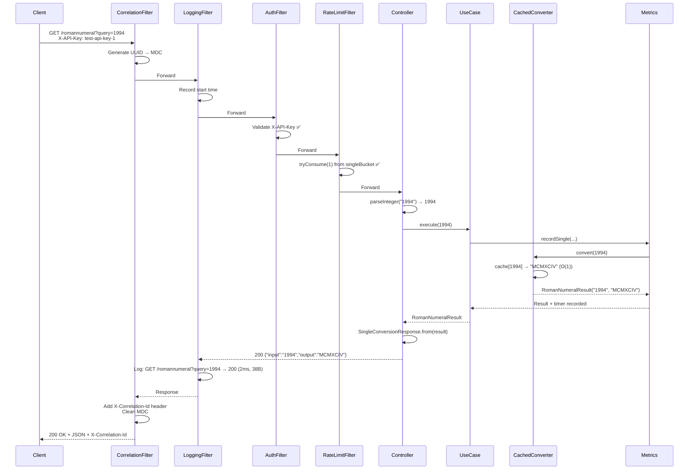
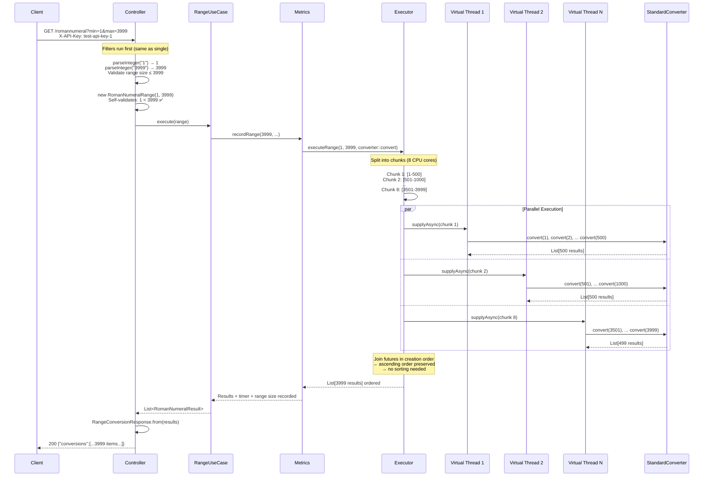
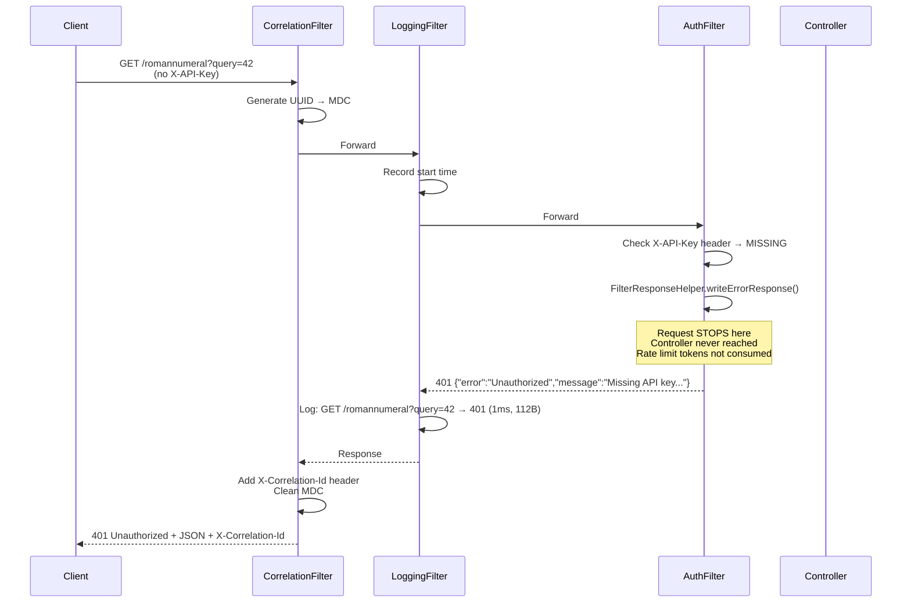
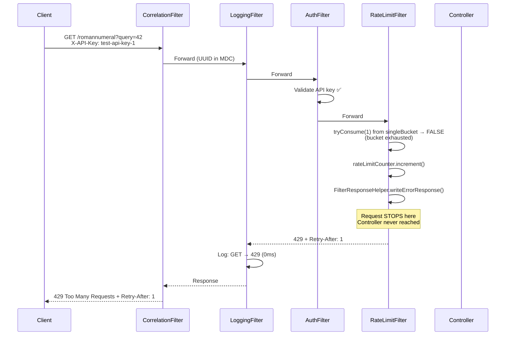
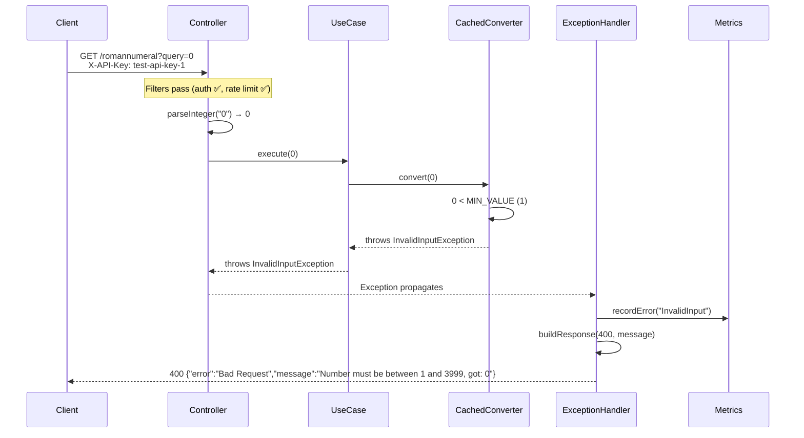
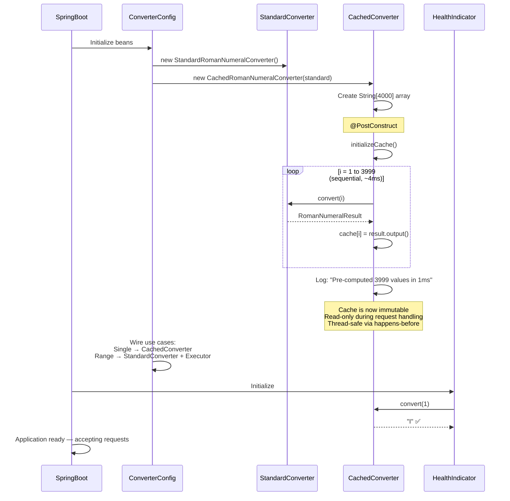
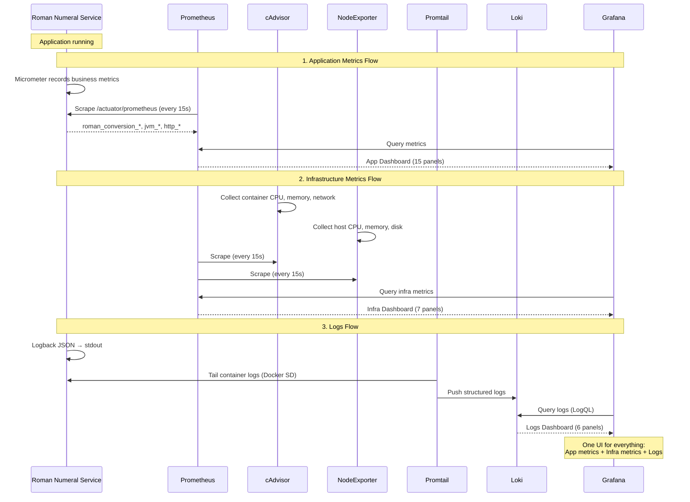

# Sequence Diagrams

Detailed request flows for the Roman Numeral Conversion Service.

---

## Single Conversion Flow

---

## Range Conversion Flow (Parallel)

---

## Authentication Failure Flow

---

## Rate Limit Exceeded Flow

---

## Domain Validation Error Flow

---

## Startup Flow (Cache Pre-computation)

---

## Observability Data Flow

